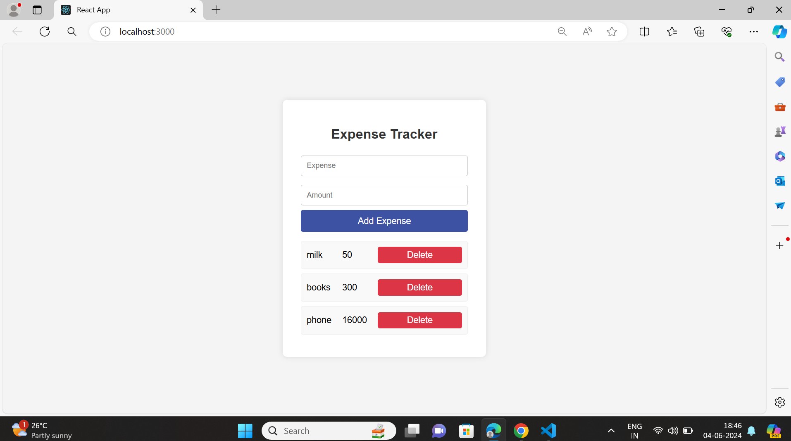

# Expense Tracker App

This is a simple Expense Tracker application built with React. It allows users to add and delete expenses, providing a basic overview of their spending.

## Features

- Add expenses with a title and amount
- Delete expenses from the list
- Simple and clean user interface

## Getting Started

These instructions will help you set up and run the project on your local machine.

### Prerequisites

- Node.js (v12 or later)
- npm (v6 or later) or yarn (v1.22 or later)

### SreenShot

