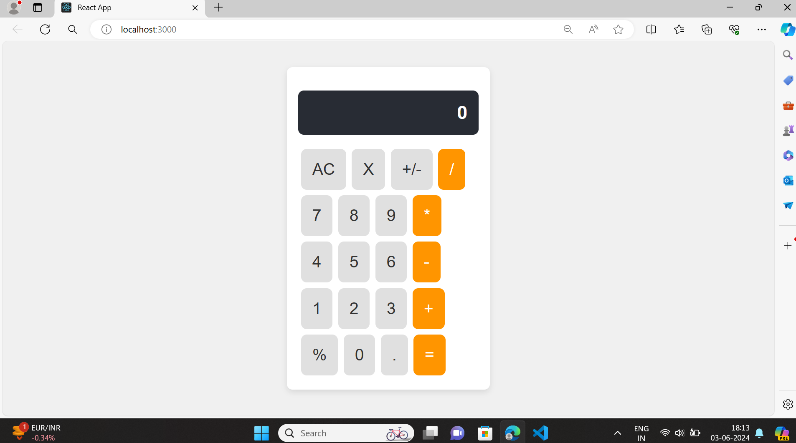

# React Calculator

This is a simple calculator application built using React. The calculator performs basic arithmetic operations and has a clean, modern UI.

## Features

- Basic arithmetic operations: addition, subtraction, multiplication, and division.
- Clear input (AC) and delete last input (X) functionality.
- Handles both integer and decimal numbers.
- Responsive design that works well on different screen sizes.

## Installation

To get started with the React Calculator, follow these steps:

1. **Clone the repository:**
    ```bash
    git clone https://github.com/your-username/react-calculator.git
    ```

2. **Navigate to the project directory:**
    ```bash
    cd react-calculator
    ```

3. **Install dependencies:**
    ```bash
    npm install
    ```

4. **Start the development server:**
    ```bash
    npm start
    ```

    The application will automatically open in your default web browser. If it doesn't, you can manually open your browser and visit `http://localhost:3000`.

## Usage

- **AC**: Clears the input field.
- **X**: Deletes the last character in the input field.
- **+/-**: Toggles the sign of the current input.
- **/**, **\***, **-**, **+**: Performs the respective arithmetic operation.
- **%**: Calculates the percentage.
- **=**: Evaluates the expression.

## Code Overview

### Components

#### `App.js`

This is the main component of the application. It maintains the state of the input field and handles all button click events.

### Styling

#### `App.css`

This file contains the styles for the calculator. It ensures all buttons have the same width and height, providing a uniform appearance. The layout uses CSS Grid to position the buttons neatly.

## Contributing

Contributions are welcome! If you have any improvements or suggestions, feel free to open a pull request or issue.

## License

This project is licensed under the MIT License - see the [LICENSE](LICENSE) file for details.
